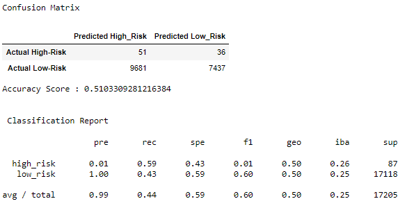

# 17-Credit_Risk_Analysis

Overview of the loan prediction risk analysis:

## The purpose of this analysis:

The purpose of this analysis is to use the credit card credit dataset from LendingClub, a peer-to-peer lending services company. We need to oversample the data using the **RandomOverSampler** and **SMOTE** algorithms, and undersample the data using the **ClusterCentroids** algorithm. Following that we need to use a combinatorial approach of over and undersampling using the **SMOTEENN** algorithm. 

Next, we need to compare two new machine learning models that reduce bias, **BalancedRandomForestClassifier** and **EasyEnsembleClassifier**, to predict credit risk. 

Once the performance of all 6 models are evaluated a written recommendation will be required on whether they should be used to predict credit risk or not.

## Reports of the 6 machine learning models:

### 1. Oversampling

### 2. SMOTE Oversampling

### 3. Undersampling

### 4. Combination (Over and Under) Sampling

%20Sampling.png)

### 5. Balance Ramdom Forest Classifer

### 6. Easy Ensemble AdaBoost Classifier

## Summary:

|Algorithm | Accuracy| Recall |
|:--------:|:-------:|:------:|
| Oversampling|0.655| 0.67|
| SMOTE Oversampling | 0.631| 0.65|
| Undersampling | 0.51| 0.44|
| Combination (Over and Under) Sampling | 0.638| 0.57|
| Balance Ramdom Forest Classifer |0.888|0.89|
| Easy Ensemble AdaBoost Classifier |0.925|0.91|

Based on the accuracy and sesitivity data, Easy Ensemble AdaBoost Classifier should be used.